# Usage Guide

QuickCard for AnkiDroid is designed to be part of your reading and learning workflow. Here is how to make the most of it.

## 1. Anki Notes and Cards

Given that this app is a companion to AnkiDroid, it is assumed that users have at least a basic understanding of Anki and its mechanics.

### 1.1. Cards

To clarify what this app is creating, here we have some examples of the types of generated cards when viewed on Anki:

| Word → definitions                                                                                | Definition → word                                                                               | Learning → native example                                                                                             | Native → learning example                                                                                             |
|---------------------------------------------------------------------------------------------------|-------------------------------------------------------------------------------------------------|-----------------------------------------------------------------------------------------------------------------------|-----------------------------------------------------------------------------------------------------------------------|
| 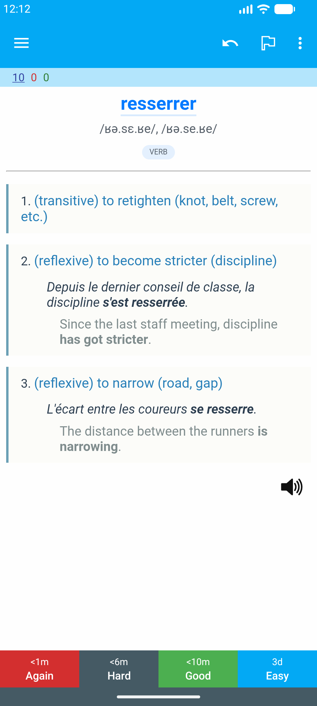 | 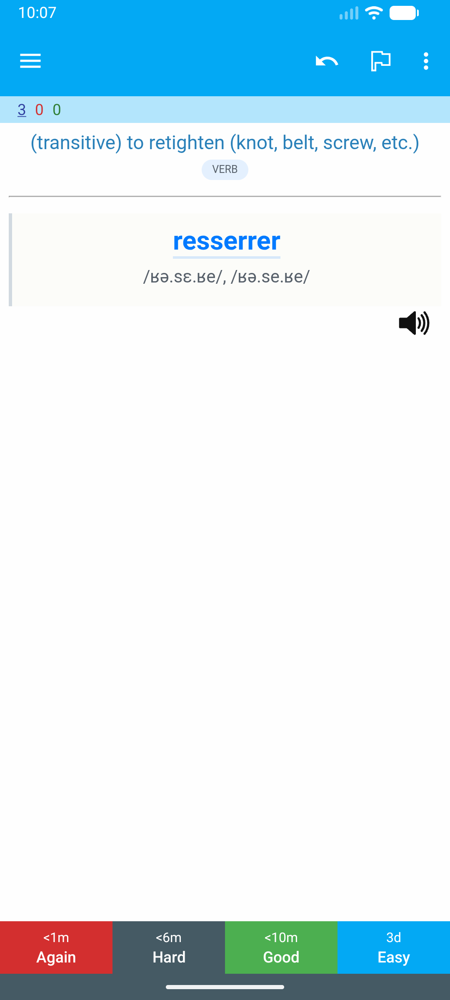 | 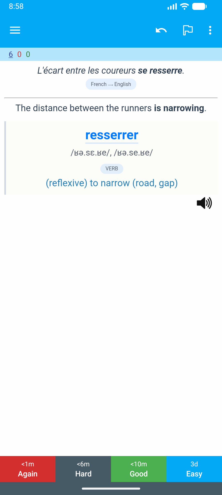 | 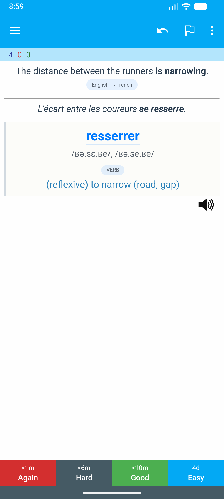 |

The cards available depend on the note type and the available fields.

### 1.2. Notes

This app produces two types of notes: Dictionary Definitions and Examples.

Both note types have a core similarity in the data they contain: a headword, grammatical class, phonetic representation, audio pronunciation, synonyms, definition(s) and example phrase(s). This already places the restriction that a single note will not be containing definitions of different grammatical classes, these will be different notes.

#### 1.2.1. Example Phrases

This is the simplest type of note. It contains only one definition of the headword plus a pair of example phrases (learning and native languages).

The learning language phrase is the ID of the card, meaning you are unlikely to encounter conflicts of duplicated cards of this type.

This note will only generate the last two types of cards shown above (_Learning-to-native-language example_ and _Native-to-learning-language example_ cards), both cards per note, so you get two cards per each exported note.

#### 1.2.2. Dictionary Definitions

This type of note is more complex. It mimics a dictionary entry, allowing up to 10 definitions per note, which is a limitation imposed by the produced note template.

This 10 definition limitation is per grammatical class (verb, noun, adverb, etc.), meaning that for a single headword you can have a card with up to 10 verbs, another with up to 10 nouns, etc. The reason is because these notes use an ID field composed of the headword and the grammatical class.

This type of note produces all the four types of cards shown above depending on the available fields:

- _Word-to-definitions_: always present;
- _Definition-to-word_: present when a definition does not contain an example pair;
- _Learning-to-native-language example_ and _Native-to-learning-language example_: present when a definition contains an example pair.

## 2. App usage

Finally, to the app usage itself.

### 2.1. Initial Setup

Before using the app, ensure you have configured your dictionary:
1.  Open the app and tap the **Hamburger Menu** (top-left).
2.  Go to **Settings**.
3.  Tap **Add** next to "Downloaded Dictionaries".
4.  Select your **Learning Language** and **Native Language**.
5.  Check the statistics and tap **Download**.
6.  Once downloaded, tap the radio button next to the dictionary in the list to set it as **Active**.

### 2.2. Searching for Words

#### 2.2.1. System-wide (long-press)

You can search for words without leaving the app you are currently reading in (like a browser):
1.  **Highlight/Select** a word in any app (long press on the desired word).
2.  In the context menu that appears (Copy, Paste, etc.), tap the three dots:
    

3.  Click **QuickCard Add**:
    

4.  The app will open directly with the definition of that word:
    
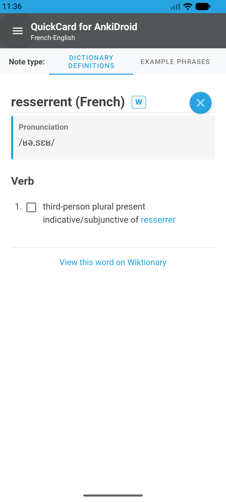

Note, however, that this contextual menu might not be available on some applications that implement their own contextual menus, like some e-book readers.
In that case you can use the Share functionality, described below.

#### 2.2.2. System-wide (Share)

Share is a very common functionality to almost every application, which can also be used for sending words to the QuickCard app. This might be useful when a contextual menu (such as described above) is not available. The process is as follows:
1.  **Highlight/Select** a word in any app (long press on the desired word).
2.  In the context menu that appears, click an option such as "Copy" or "Share":
    

3.  If needed, click the Share icon ():
    

4.  Click **QuickCard for AnkiDroid - Add**:
    
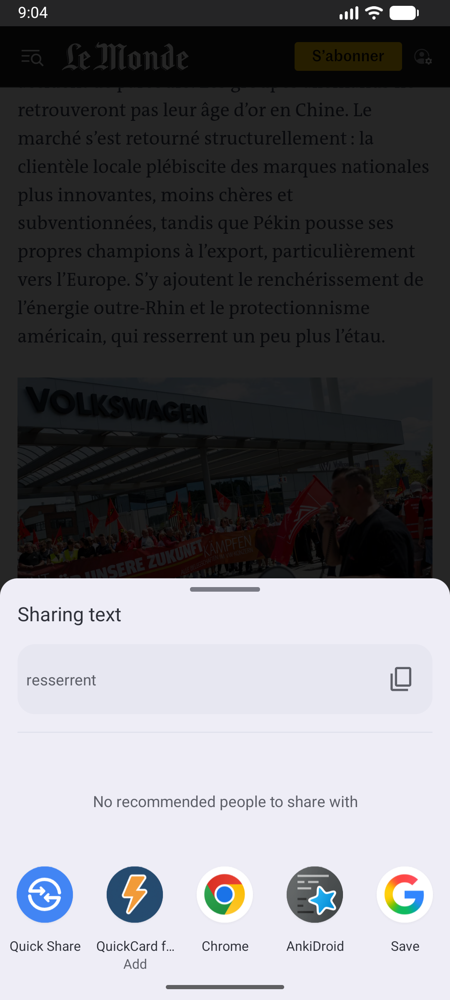

5.  The app will open directly with the definition of that word.

#### 2.2.3. Within the App

1.  On the main screen, enter a word in the search box and tap the **Search** icon.
2.  The app will fetch results from your active dictionary.

### 2.3. Creating Flashcards

Once you have a definition open, you'll be able to select elements for exporting, but which elements change based on the type of note you decide to export. The selector for note type is at the very top of the definition view.

#### 2.3.1. Example Phrases

With this note type, you will get a checkbox on the side of each example phrase pair. You simply select all the examples you want. Example:

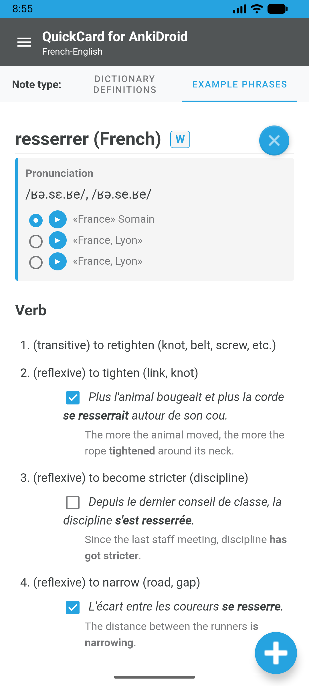

Once you're satisfied with your choice, click the big blue plus button at the bottom right of the screen to export your notes, which will present a confirmation banner at the bottom:

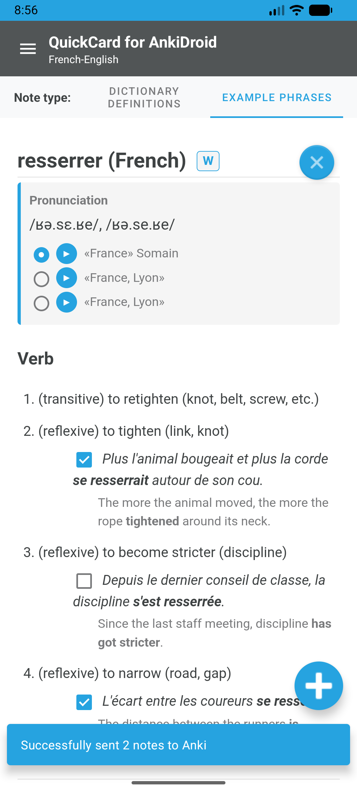

Since each example pair is a note, and the note ID is the learning example phrase, it is assumed that conflicts are (accidental) re-exports of the same example. Therefore such notes will be skipped when exporting thus preserving your previously exported note. If you want to update an old note you might have to do it manually or delete the note and re-export.

#### 2.3.2. Dictionary Definitions

With it, you use the available checkboxes to select which definitions you want to export. If any definition has at least one pair of learning-native example phrases, a set of radio buttons will be displayed, allowing you to select which example phrase pair you want to be exported for that particular definition. Example:

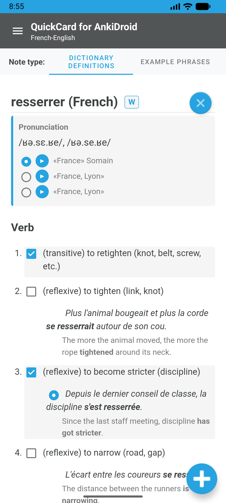

Once you're satisfied with your choice, click the big blue plus button at the bottom right of the screen to export your notes, which will present a confirmation banner at the bottom:

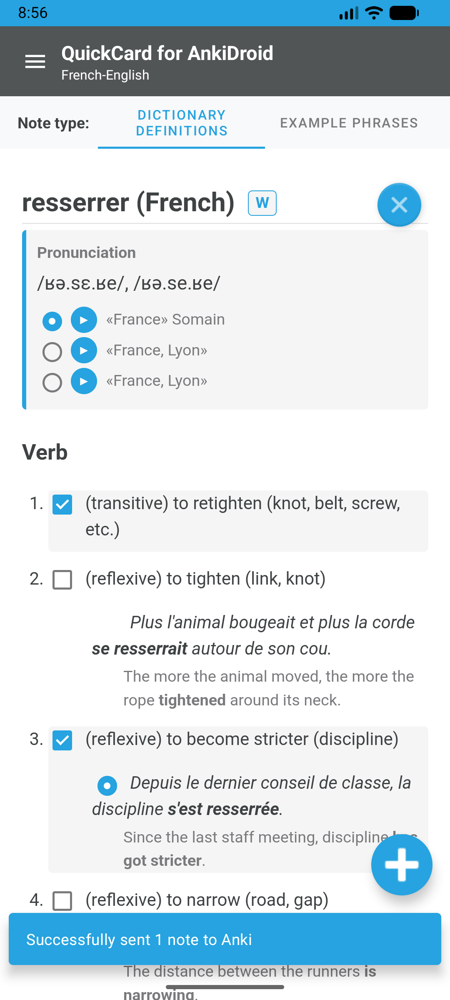

Since the notes are scoped per grammatical class, one note will be exported per grammatical class of the exported definitions: if you choose three noun definitions and three verb definitions of a certain word then two notes will be exported.

Also, since the ID of the notes includes the headword and the grammatical class, you will get an error if you try to export a new note for headword of a grammatical class that you already exported before. If you want to amend an existing note, you have to either do it manually or delete and re-export.

### 2.4. The Enqueue System

If you are reading a long text and don't want to stop to create cards for every new word:
1.  Use the contextual menu (as described in section 2.2.1) and choose **QuickCard Enqueue** or the share menu (as described in section 2.2.2) and choose **QuickCard for AnkiDroid - Enqueue**.
    - The word will be added to the _Enqueued Words_ list of the app without leaving your original reading app.
2.  Later, open _QuickCard for AnkiDroid_, and you will see your enqueued words on the main screen.
    
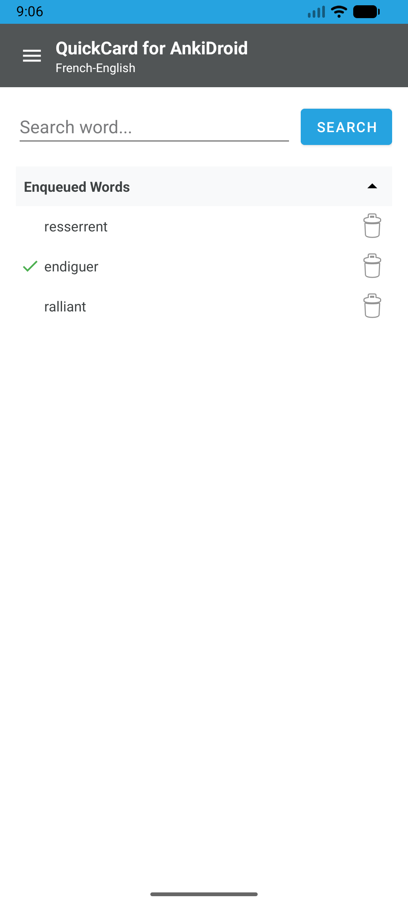

3.  Tap any word in the list to open it and create your cards as usual.
4.  Words that have been exported into at least one note will show a checkmark in the _Enqueued Words_ list but will not be removed automatically.
    - You can remove them by tapping the trashcan icon on the side of a word.
    - Words without checkmarks will require a prompt before removal to prevent accidental removal of a word that was not used for exporting new notes.
    - Words with checkmarks will be removed without a prompt upon clicking the trashcan icon.

## 3. Anki note/template tweaks

You're free to adapt and tweak the exported note types and the future exported cards will continue to use the modified note template, allowing you a high degree of customization to fit your needs.

Some potential customization you can do are:
- any change to HTML or CSS templates;
- adding or removing card types;
- adding new fields;
- reordering fields (except the first (ID) field.

The only real restrictions are:
- You must not remove or rename fields;
  - If you do so, exports will fail due to the lack of expected field names. 

If you rename the note types, a new one will be generated with the original name and be used for new exports.

### 3.1. Extra fields

Automatically exported cards based on dictionary data are a best-effort but can't possibly always be the best you need for every situation, so it is expected that a few times you might need to step in to improve a card.

Aiming for that, each note type have a few extra fields to help you with that:

- "Alt Text" fields: intended to provide an additional variation of each phrase (learning and native), to be shown along the "base" text;
  - Intended to be used in case there's a different way to say it with an equivalent meaning, and you want to capture that subtlety;
- "Listed" fields: only for Dictionary Definition notes, a flag field that can be made empty, causing the respective definition and example phrases to be removed from the word-to-definitions card (but not all the others card types);
  - Might be useful for slightly less useful or redundant definitions that you want to have cards to practice but not bloat a potentially long list of definitions;
- "Personal Notes": any type of additional information that you want to add about the note;
  - Will be presented at the bottom of every card;
- "Hidden Notes": additional information about the note, but will not be presented anywhere;
  - Intended for self documentation;
- "Source URL": URl to the original Wiktionary article, in case you need to refer to it for any reason.

If even with those fields you consider any card in particular not useful in an otherwise good note (for example, the native-learning example phrase is not very useful or highly ambiguous while the reverse is a good card), you may just consider suspending it.

## 4. Troubleshooting AnkiDroid Integration

### Failed integration

If the app fails to send cards to AnkiDroid:
1.  Open **AnkiDroid**.
2.  Go to **Settings** > **AnkiDroid** > **3rd party API access**.
3.  Ensure it is **Enabled**.
4.  If it was already enabled, try disabling and re-enabling it.
